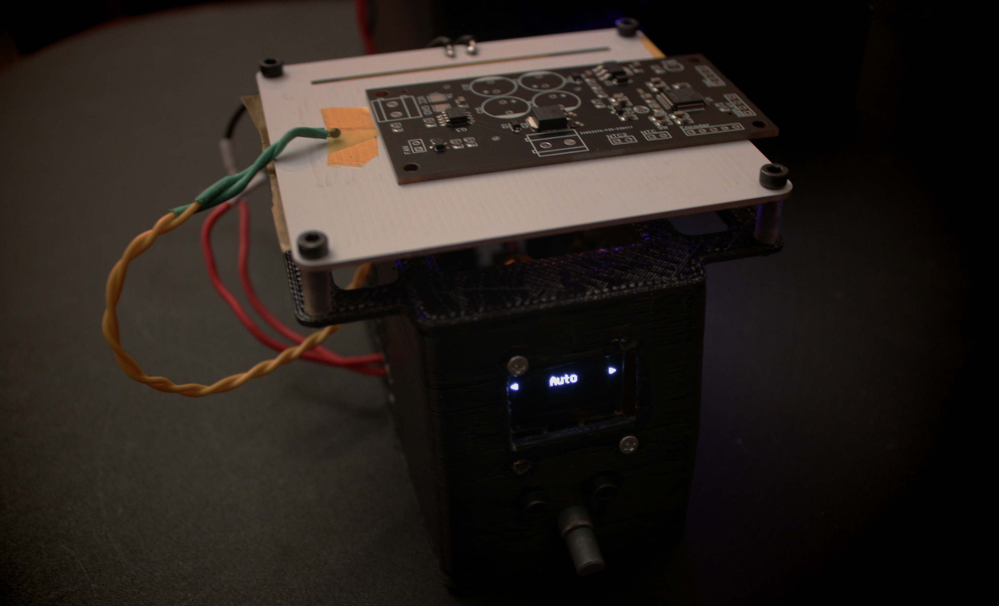

# Reflow Plate

> Complete Firmware + Hardware for a hot plate reflow solder system.

## Summary

This project aims to make SMD soldering easier with a cost efficent solution by using a controller and a hot plate. Reflow Plate project was mainly inspired from the [DerSpatz](https://github.com/DerSpatz/PCB-reflow-solder-heat-plate) but ported to STM32 platorm and the firmware is entirely written from scratch to support modularity and ease of configuration. Firmware also incorporates some extra features by utilizing the extra memory and flash space provided by the more advanced stm32 chips. Project aims to be a complete solution by providing firmare, hardware, 3d models and even a PC control application.

## Hardware

Additional details on hardware can be found in [Hardware](./Hardware/README.md).

## Firmware

Additional details on firmware can be found in [Firmware](./Firmware/README.MD).

## 3D Enclosing Box

Additional details on 3d models can be found in [Firmware](./3D/README.md).

## GUI Application

Additional details on GUI application can be found in [GUI Readme](./GUI/README.md).

### Sourcing

This project can be directly ordered by using JLCPCB assembly service. Connectors, 7A Fuse, Radial capacitors, LED are discarded from SMT assembly to reduce costs. OLED Display, Rotary Encoder, NTC, STLink (Used to flash) also have to be sourced seperately. For hot plate, I would recommend getting an aluminum plate as the costs are pretty much the same.

### Discussion

Join the discord community for further discussion.

## Credits

- [DerSpatz](https://github.com/DerSpatz/PCB-reflow-solder-heat-plate) - For original hardware design

## License

Licenses linked to this main project can be found in the related sub-folders.
